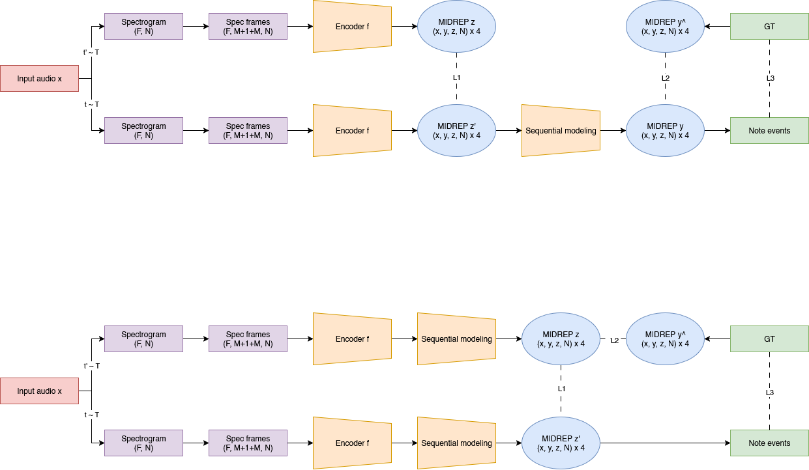

# Musically Informed Data Representations for Automatic Music Transcription

The purpose of this work is to evaluate the effectiveness of alternative data representations in symbolic music modeling. They will be tested both as a model output and as a latent space representation.

This includes, but is not limited to:
- Traditional 2D array
- Spiral note array
- Torus
- Tonnetz graphs  

The general pipelines I'll try for now is the following:

*Repo is a work in process and doesn't really rork yet*